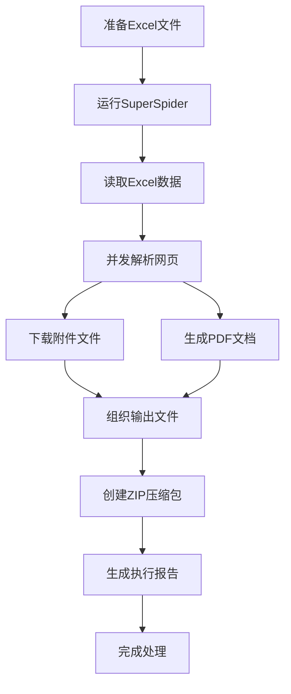

# SuperSpider产品需求文档

## 1. 产品概述

SuperSpider是一个功能强大的智能网页爬虫工具，专门设计用于批量处理URL、自动下载附件和生成PDF文档。该工具具备完善的中文编码支持，能够准确处理中文网页内容，为用户提供高效的网页内容批量处理解决方案。

产品主要解决批量网页内容处理的痛点，适用于需要大量收集网页内容和附件的用户，如研究人员、数据分析师、内容管理员等。通过自动化处理，显著提高工作效率，减少手动操作成本。

## 2. 核心功能

### 2.1 用户角色

本产品为单用户工具，无需用户注册和权限管理，所有用户均可直接使用全部功能。

### 2.2 功能模块

我们的SuperSpider需求包含以下主要功能模块：

1. **Excel文件处理模块**：读取和解析Excel文件中的URL列表
2. **网页解析模块**：智能解析网页内容，提取附件链接
3. **文件下载模块**：并发下载附件文件，支持断点续传
4. **PDF生成模块**：将网页内容转换为高质量PDF文档
5. **文件管理模块**：组织输出文件，生成压缩包
6. **日志监控模块**：详细记录执行过程和错误信息

### 2.3 页面详情

| 功能模块 | 子功能 | 功能描述 |
|----------|--------|----------|
| Excel文件处理 | 文件读取 | 支持.xlsx和.xls格式，读取URL和标题列，验证数据有效性 |
| Excel文件处理 | 数据验证 | 检查URL格式正确性，处理空值和重复数据 |
| 网页解析 | 内容获取 | 发送HTTP请求获取网页内容，支持重试机制和超时控制 |
| 网页解析 | 编码检测 | 智能检测网页编码，支持UTF-8、GBK、GB2312等中文编码 |
| 网页解析 | 附件识别 | 解析HTML结构，识别PDF、DOC、XLS等附件链接 |
| 文件下载 | 并发下载 | 多线程并发下载附件，可配置并发数量 |
| 文件下载 | 断点续传 | 支持下载中断后的续传功能，避免重复下载 |
| 文件下载 | 文件命名 | 按"标题_附件序号_原文件名"格式命名，避免重名冲突 |
| PDF生成 | 内容转换 | 将网页HTML内容转换为PDF格式，保持原有布局 |
| PDF生成 | 中文支持 | 优化中文字体处理，确保中文字符正确显示 |
| PDF生成 | 样式优化 | 自定义PDF样式，包括页面布局、字体大小等 |
| 文件管理 | 目录组织 | 按时间戳创建输出目录，分类存放PDF和附件 |
| 文件管理 | 压缩打包 | 将处理结果打包成ZIP文件，便于分发和存储 |
| 文件管理 | 临时清理 | 自动清理临时文件，释放磁盘空间 |
| 日志监控 | 执行日志 | 记录详细的执行过程，包括成功和失败信息 |
| 日志监控 | 错误处理 | 捕获和记录各类异常，提供错误恢复建议 |
| 日志监控 | 进度报告 | 生成执行报告，统计处理结果和性能指标 |

## 3. 核心流程

### 主要用户操作流程

1. **准备阶段**：用户在input目录下放置包含URL列表的Excel文件
2. **执行阶段**：运行SuperSpider命令，指定处理参数（并发数、超时时间等）
3. **处理阶段**：系统自动读取Excel文件，并发解析网页，下载附件，生成PDF
4. **输出阶段**：系统将处理结果组织到输出目录，生成ZIP压缩包
5. **查看阶段**：用户查看处理报告，获取下载的文件和生成的PDF

## 4. 用户界面设计

### 4.1 设计风格

SuperSpider作为命令行工具，主要通过终端界面与用户交互：

- **主色调**：终端默认颜色（黑底白字或白底黑字）
- **强调色**：绿色表示成功，红色表示错误，黄色表示警告
- **字体**：等宽字体（如Consolas、Monaco），确保对齐效果
- **布局风格**：简洁的命令行界面，清晰的进度显示和日志输出
- **图标风格**：使用ASCII字符和Unicode符号增强视觉效果

### 4.2 界面设计概览

| 界面类型 | 组件 | UI元素 |
|----------|------|--------|
| 命令行界面 | 参数输入 | 支持多种命令行参数，包括文件路径、并发数、超时时间等配置选项 |
| 命令行界面 | 进度显示 | 实时显示处理进度，包括已处理URL数量、下载进度、错误统计等 |
| 命令行界面 | 日志输出 | 分级日志显示（INFO、WARNING、ERROR），支持详细调试模式 |
| 命令行界面 | 结果展示 | 处理完成后显示统计信息，包括成功数量、失败数量、执行时间等 |
| 文件输出 | 执行报告 | 生成JSON格式的详细执行报告，包含所有处理结果和错误信息 |
| 文件输出 | 日志文件 | 保存完整的执行日志到文件，便于后续分析和问题排查 |

### 4.3 响应性

作为命令行工具，SuperSpider主要在桌面环境下运行，支持Windows、macOS和Linux操作系统。界面设计考虑不同终端窗口大小的适配，确保信息显示完整和易读。