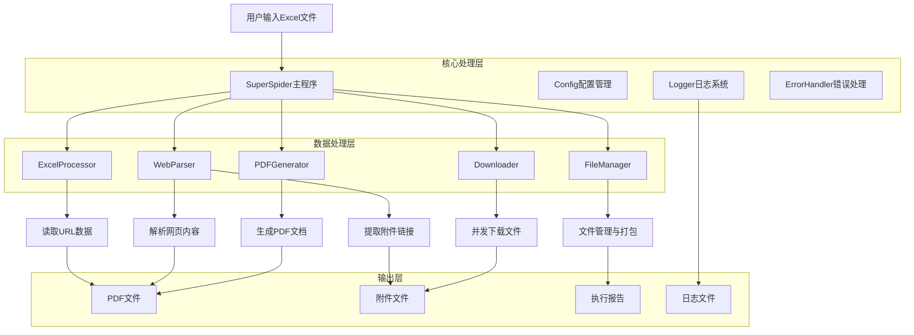
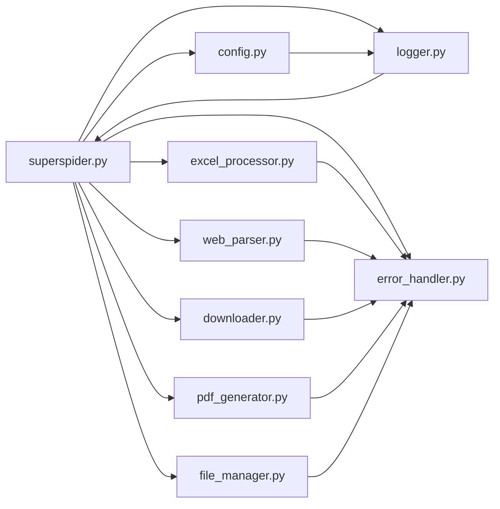
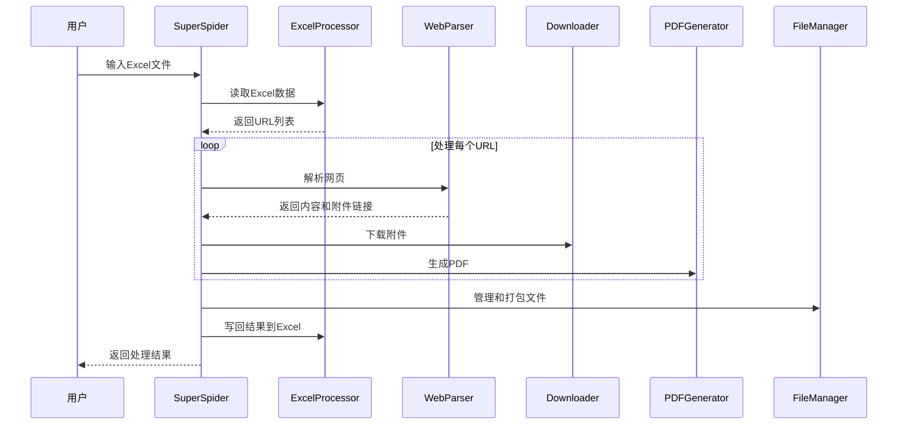
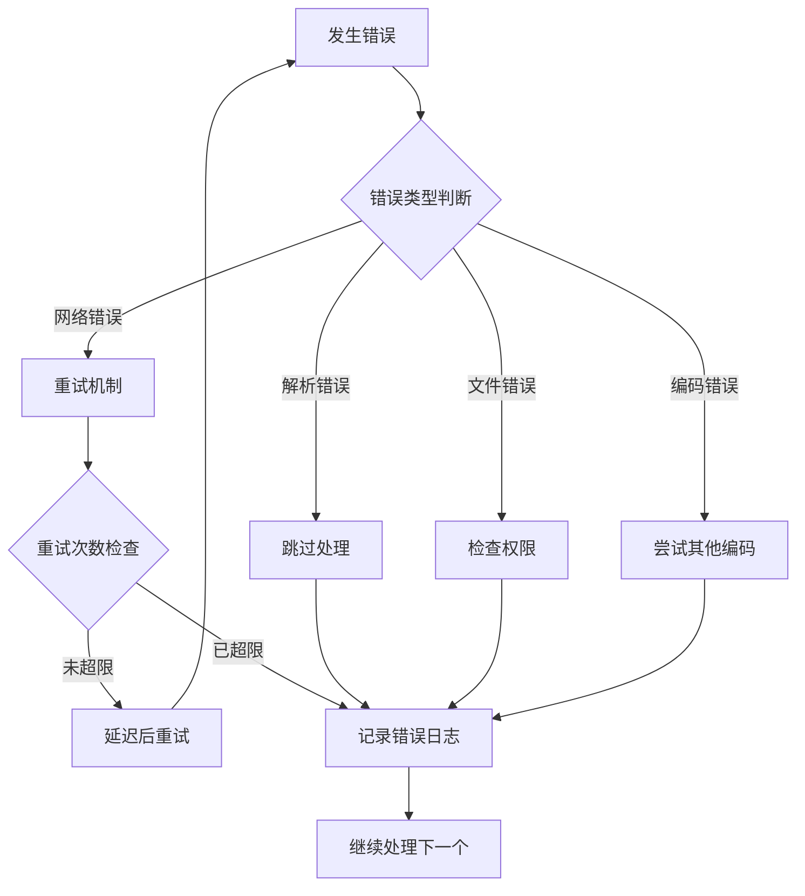

# SuperSpider 技术架构文档

## 1. 架构设计



## 2. 技术栈描述

### 核心技术
- **语言**: Python 3.7+
- **HTTP请求**: requests + urllib3
- **HTML解析**: BeautifulSoup4 + lxml
- **Excel处理**: pandas + openpyxl
- **PDF生成**: ReportLab
- **编码检测**: chardet
- **并发处理**: threading + concurrent.futures

### 依赖包详情
```
核心依赖:
- requests>=2.28.0          # HTTP请求处理
- beautifulsoup4>=4.11.0     # HTML解析
- openpyxl>=3.0.10          # Excel文件操作
- pandas>=1.5.0             # 数据处理
- reportlab>=3.6.0          # PDF生成
- chardet>=5.0.0            # 编码检测
- pyyaml>=6.0               # 配置文件处理
- lxml>=4.9.0               # XML/HTML解析器
- html5lib>=1.1             # HTML5解析器
```

## 3. 模块架构

### 3.1 核心模块关系



### 3.2 模块职责

| 模块 | 主要职责 | 关键类/函数 |
|------|----------|-------------|
| `superspider.py` | 主控制器，协调各模块 | `SuperSpider` |
| `config.py` | 配置管理和参数设置 | `Config` |
| `logger.py` | 日志记录和管理 | `Logger` |
| `excel_processor.py` | Excel文件读写处理 | `ExcelProcessor` |
| `web_parser.py` | 网页解析和内容提取 | `WebParser` |
| `downloader.py` | 文件下载和并发控制 | `Downloader` |
| `pdf_generator.py` | PDF文档生成 | PDF生成函数 |
| `file_manager.py` | 文件管理和打包 | `FileManager` |
| `error_handler.py` | 错误处理和重试 | `ErrorHandler` |

## 4. 数据流设计

### 4.1 主要数据流



### 4.2 数据结构

#### URL数据结构
```python
url_data = {
    'url': str,           # 网页URL
    'title': str,         # 页面标题
    'index': int          # 在Excel中的行号
}
```

#### 处理结果结构
```python
result = {
    'index': int,                    # Excel行号
    'url': str,                     # 原始URL
    'title': str,                   # 页面标题
    'success': bool,                # 处理是否成功
    'attachments_count': int,       # 下载的附件数量
    'pdf_generated': bool,          # PDF是否生成成功
    'error': str,                   # 错误信息
    'completion_time': str          # 完成时间
}
```

## 5. 核心算法

### 5.1 智能编码检测算法

```python
def smart_decode_response(self, response):
    """
    智能解码HTTP响应内容
    优先级：HTTP头 > chardet检测 > 常见中文编码 > UTF-8容错
    """
    # 1. 尝试HTTP头中的编码
    content_type = response.headers.get('content-type', '')
    if 'charset=' in content_type:
        charset = extract_charset(content_type)
        try:
            return response.content.decode(charset)
        except UnicodeDecodeError:
            pass
    
    # 2. 使用chardet自动检测
    detected = chardet.detect(response.content)
    if detected['confidence'] > 0.7:
        try:
            return response.content.decode(detected['encoding'])
        except UnicodeDecodeError:
            pass
    
    # 3. 尝试常见中文编码
    for encoding in ['utf-8', 'gbk', 'gb2312', 'gb18030', 'big5']:
        try:
            return response.content.decode(encoding)
        except UnicodeDecodeError:
            continue
    
    # 4. 最后使用UTF-8容错模式
    return response.content.decode('utf-8', errors='ignore')
```

### 5.2 并发下载控制算法

```python
def concurrent_download(self, download_tasks):
    """
    并发下载控制算法
    使用ThreadPoolExecutor实现并发限制
    """
    with ThreadPoolExecutor(max_workers=self.config.concurrent_limit) as executor:
        # 提交所有下载任务
        future_to_task = {
            executor.submit(self.download_file, task): task 
            for task in download_tasks
        }
        
        # 收集结果
        results = []
        for future in as_completed(future_to_task):
            task = future_to_task[future]
            try:
                result = future.result(timeout=self.config.timeout)
                results.append(result)
            except Exception as e:
                self.handle_download_error(task, e)
        
        return results
```

### 5.3 重试机制算法

```python
def retry_with_backoff(self, func, *args, **kwargs):
    """
    指数退避重试算法
    """
    for attempt in range(self.config.retry_times + 1):
        try:
            return func(*args, **kwargs)
        except Exception as e:
            if attempt == self.config.retry_times:
                raise e
            
            # 指数退避延迟
            delay = self.config.retry_delay * (2 ** attempt)
            time.sleep(delay)
            self.logger.warning(f"重试第{attempt + 1}次，延迟{delay}秒")
```

## 6. 性能优化

### 6.1 并发优化
- **线程池管理**: 使用ThreadPoolExecutor控制并发数
- **连接复用**: 使用requests.Session复用HTTP连接
- **超时控制**: 设置合理的请求超时时间
- **资源限制**: 限制同时处理的URL数量

### 6.2 内存优化
- **流式处理**: 大文件采用流式下载
- **及时清理**: 处理完成后及时清理临时文件
- **分批处理**: 大量URL分批处理避免内存溢出

### 6.3 网络优化
- **智能重试**: 网络失败时的指数退避重试
- **User-Agent轮换**: 避免被反爬虫机制阻止
- **请求头优化**: 模拟真实浏览器请求

## 7. 错误处理策略

### 7.1 错误分类

```python
class ErrorTypes:
    NETWORK_ERROR = "网络错误"        # 网络连接问题
    PARSE_ERROR = "解析错误"          # 网页解析失败
    FILE_ERROR = "文件错误"           # 文件操作失败
    ENCODING_ERROR = "编码错误"       # 字符编码问题
    TIMEOUT_ERROR = "超时错误"        # 请求超时
    PERMISSION_ERROR = "权限错误"     # 文件权限问题
```

### 7.2 错误处理流程



## 8. 安全考虑

### 8.1 输入验证
- **URL格式验证**: 检查URL格式的合法性
- **文件路径验证**: 防止路径遍历攻击
- **文件大小限制**: 限制下载文件的最大大小

### 8.2 网络安全
- **HTTPS优先**: 优先使用HTTPS协议
- **证书验证**: 验证SSL证书的有效性
- **请求限制**: 限制请求频率避免被封禁

### 8.3 文件安全
- **临时文件清理**: 及时清理临时文件
- **权限控制**: 设置适当的文件权限
- **病毒扫描**: 建议对下载文件进行安全扫描

## 9. 监控和日志

### 9.1 日志级别
- **DEBUG**: 详细的调试信息
- **INFO**: 一般信息记录
- **WARNING**: 警告信息
- **ERROR**: 错误信息

### 9.2 监控指标
- **处理成功率**: 成功处理的URL比例
- **下载速度**: 平均下载速度
- **错误率**: 各类错误的发生频率
- **资源使用**: CPU和内存使用情况

### 9.3 日志格式
```
2024-01-15 14:30:25,123 - INFO - SuperSpider - 开始处理URL: https://example.com
2024-01-15 14:30:26,456 - DEBUG - WebParser - 检测到编码: utf-8
2024-01-15 14:30:27,789 - WARNING - Downloader - 下载重试: attachment.pdf
2024-01-15 14:30:28,012 - ERROR - PDFGenerator - PDF生成失败: 字体加载错误
```

## 10. 扩展性设计

### 10.1 插件化架构
- **解析器插件**: 支持添加新的网站解析器
- **下载器插件**: 支持不同的下载策略
- **输出格式插件**: 支持新的输出格式

### 10.2 配置化设计
- **动态配置**: 支持运行时修改配置
- **环境配置**: 支持不同环境的配置
- **用户配置**: 支持用户自定义配置

### 10.3 API接口设计
```python
class SuperSpiderAPI:
    def process_urls(self, urls: List[str]) -> Dict:
        """批量处理URL接口"""
        pass
    
    def add_parser(self, domain: str, parser: Callable):
        """添加自定义解析器"""
        pass
    
    def set_config(self, config: Dict):
        """设置配置参数"""
        pass
```

---

**该技术架构文档为SuperSpider项目的核心技术实现提供了全面的说明，便于开发团队理解和维护项目。**