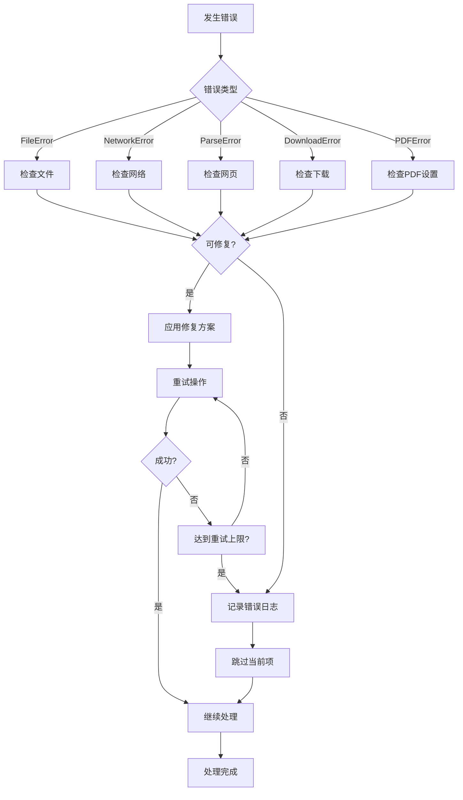

# SuperSpider 故障排除与维护指南

## 📋 目录
1. [常见问题排查](#常见问题排查)
2. [错误代码说明](#错误代码说明)
3. [性能优化](#性能优化)
4. [日志分析](#日志分析)
5. [系统维护](#系统维护)
6. [监控指标](#监控指标)

## 🔍 常见问题排查

### 1.1 Excel文件相关问题

#### 问题：Excel文件读取失败
**症状**：
```
FileError: Excel文件不存在: input/urls.xlsx
```

**排查步骤**：
1. 检查文件路径是否正确
2. 确认文件是否存在
3. 检查文件权限
4. 验证文件格式（.xlsx, .xls）

**解决方案**：
```bash
# 检查文件是否存在
ls -la input/

# 检查文件权限
chmod 644 input/urls.xlsx

# 验证文件格式
file input/urls.xlsx
```

#### 问题：URL列识别失败
**症状**：
```
FileError: Excel文件中未找到URL列
```

**排查步骤**：
1. 检查Excel文件中的列名
2. 确认URL列是否包含有效数据
3. 检查列名是否符合规范

**解决方案**：
- 支持的URL列名：`url`, `URL`, `link`, `链接`, `网址`
- 确保URL列包含有效的网址数据
- 如果列名不符合规范，请重命名列

### 1.2 网络连接问题

#### 问题：网络请求超时
**症状**：
```
NetworkError: 请求超时: https://example.com
```

**排查步骤**：
1. 检查网络连接状态
2. 测试目标网站是否可访问
3. 检查防火墙设置
4. 验证代理配置

**解决方案**：
```bash
# 测试网络连接
ping google.com

# 测试目标网站
curl -I https://example.com

# 增加超时时间
python superspider.py --timeout 60

# 减少并发数
python superspider.py --concurrent 3
```

#### 问题：SSL证书验证失败
**症状**：
```
SSLError: [SSL: CERTIFICATE_VERIFY_FAILED]
```

**解决方案**：
```python
# 在web_parser.py中添加SSL配置
import ssl
import requests
from requests.adapters import HTTPAdapter
from urllib3.util.ssl_ import create_urllib3_context

# 创建自定义SSL上下文
ctx = create_urllib3_context()
ctx.check_hostname = False
ctx.verify_mode = ssl.CERT_NONE
```

### 1.3 编码问题

#### 问题：中文字符显示乱码
**症状**：PDF或日志中出现乱码字符

**排查步骤**：
1. 检查系统字体安装
2. 验证网页原始编码
3. 查看编码检测日志

**解决方案**：
```bash
# 安装中文字体（Ubuntu/Debian）
sudo apt-get install fonts-wqy-zenhei fonts-wqy-microhei

# 安装中文字体（CentOS/RHEL）
sudo yum install wqy-zenhei-fonts wqy-microhei-fonts

# macOS安装字体
brew install font-wqy-zenhei
```

### 1.4 PDF生成问题

#### 问题：PDF生成失败
**症状**：
```
PDFError: PDF生成失败: 字体加载错误
```

**排查步骤**：
1. 检查ReportLab安装
2. 验证字体文件存在
3. 检查内存使用情况

**解决方案**：
```python
# 在pdf_generator.py中添加字体检查
from reportlab.pdfbase import pdfmetrics
from reportlab.pdfbase.ttfonts import TTFont

def check_fonts():
    """检查字体是否可用"""
    try:
        # 注册字体
        pdfmetrics.registerFont(TTFont('SimHei', 'SimHei.ttf'))
        return True
    except Exception as e:
        print(f"字体加载失败: {e}")
        return False
```

### 1.5 内存和性能问题

#### 问题：内存使用过高
**症状**：系统内存占用持续增长，可能导致程序崩溃

**排查步骤**：
1. 监控内存使用情况
2. 检查并发数设置
3. 分析处理的文件大小

**解决方案**：
```bash
# 监控内存使用
top -p $(pgrep -f superspider)

# 减少并发数
python superspider.py --concurrent 3

# 分批处理大文件
# 将大的Excel文件拆分成多个小文件
```

```python
# 在代码中添加内存监控
import psutil
import gc

def monitor_memory():
    """监控内存使用"""
    process = psutil.Process()
    memory_info = process.memory_info()
    print(f"内存使用: {memory_info.rss / 1024 / 1024:.2f} MB")
    
    # 强制垃圾回收
    gc.collect()
```

## 📊 错误代码说明

### 2.1 错误分类

| 错误代码 | 错误类型 | 描述 | 解决方案 |
|----------|----------|------|----------|
| E001 | FileError | Excel文件不存在 | 检查文件路径 |
| E002 | FileError | Excel文件格式错误 | 确认文件格式 |
| E003 | FileError | URL列未找到 | 检查列名规范 |
| N001 | NetworkError | 连接超时 | 增加超时时间 |
| N002 | NetworkError | DNS解析失败 | 检查网络设置 |
| N003 | NetworkError | SSL证书错误 | 配置SSL设置 |
| P001 | ParseError | 网页解析失败 | 检查网页结构 |
| P002 | ParseError | 编码检测失败 | 手动指定编码 |
| D001 | DownloadError | 文件下载失败 | 检查文件链接 |
| D002 | DownloadError | 磁盘空间不足 | 清理磁盘空间 |
| PDF001 | PDFError | 字体加载失败 | 安装中文字体 |
| PDF002 | PDFError | 内容过长 | 分页处理 |

### 2.2 错误处理流程



## ⚡ 性能优化

### 3.1 并发优化

#### 最佳并发数设置
```python
# 根据系统资源动态设置并发数
import os
import psutil

def get_optimal_concurrent_limit():
    """获取最佳并发数"""
    cpu_count = os.cpu_count()
    memory_gb = psutil.virtual_memory().total / (1024**3)
    
    # 基于CPU核心数和内存大小计算
    if memory_gb >= 8:
        return min(cpu_count * 2, 10)
    elif memory_gb >= 4:
        return min(cpu_count, 5)
    else:
        return min(cpu_count // 2, 3)
```

#### 连接池优化
```python
# 在web_parser.py中优化连接池
import requests
from requests.adapters import HTTPAdapter
from urllib3.util.retry import Retry

class OptimizedSession:
    def __init__(self):
        self.session = requests.Session()
        
        # 配置重试策略
        retry_strategy = Retry(
            total=3,
            backoff_factor=1,
            status_forcelist=[429, 500, 502, 503, 504],
        )
        
        # 配置连接池
        adapter = HTTPAdapter(
            max_retries=retry_strategy,
            pool_connections=20,
            pool_maxsize=20
        )
        
        self.session.mount("http://", adapter)
        self.session.mount("https://", adapter)
```

### 3.2 内存优化

#### 流式处理大文件
```python
def download_large_file(url, filename):
    """流式下载大文件"""
    with requests.get(url, stream=True) as response:
        response.raise_for_status()
        with open(filename, 'wb') as f:
            for chunk in response.iter_content(chunk_size=8192):
                if chunk:
                    f.write(chunk)
```

#### 定期清理临时文件
```python
import tempfile
import shutil
from pathlib import Path

def cleanup_temp_files():
    """清理临时文件"""
    temp_dir = Path(tempfile.gettempdir())
    superspider_temps = temp_dir.glob('superspider_*')
    
    for temp_path in superspider_temps:
        try:
            if temp_path.is_file():
                temp_path.unlink()
            elif temp_path.is_dir():
                shutil.rmtree(temp_path)
        except Exception as e:
            print(f"清理临时文件失败: {e}")
```

### 3.3 缓存优化

```python
from functools import lru_cache
import hashlib

class WebParserCache:
    """网页解析缓存"""
    
    def __init__(self, cache_size=128):
        self.cache = {}
        self.cache_size = cache_size
    
    def get_cache_key(self, url):
        """生成缓存键"""
        return hashlib.md5(url.encode()).hexdigest()
    
    def get(self, url):
        """获取缓存"""
        key = self.get_cache_key(url)
        return self.cache.get(key)
    
    def set(self, url, content):
        """设置缓存"""
        if len(self.cache) >= self.cache_size:
            # 删除最旧的缓存项
            oldest_key = next(iter(self.cache))
            del self.cache[oldest_key]
        
        key = self.get_cache_key(url)
        self.cache[key] = content
```

## 📝 日志分析

### 4.1 日志级别和格式

```python
# 日志配置示例
LOGGING_CONFIG = {
    'version': 1,
    'disable_existing_loggers': False,
    'formatters': {
        'detailed': {
            'format': '%(asctime)s - %(name)s - %(levelname)s - %(message)s'
        },
        'simple': {
            'format': '%(levelname)s - %(message)s'
        }
    },
    'handlers': {
        'file': {
            'level': 'DEBUG',
            'class': 'logging.handlers.RotatingFileHandler',
            'filename': 'superspider.log',
            'maxBytes': 10485760,  # 10MB
            'backupCount': 5,
            'formatter': 'detailed'
        },
        'console': {
            'level': 'INFO',
            'class': 'logging.StreamHandler',
            'formatter': 'simple'
        }
    },
    'loggers': {
        'superspider': {
            'handlers': ['file', 'console'],
            'level': 'DEBUG',
            'propagate': False
        }
    }
}
```

### 4.2 关键日志分析

#### 性能分析
```bash
# 分析处理时间
grep "处理完成" superspider.log | awk '{print $1, $2, $NF}'

# 统计错误类型
grep "ERROR" superspider.log | awk '{print $4}' | sort | uniq -c

# 分析网络请求耗时
grep "请求耗时" superspider.log | awk '{print $NF}' | sort -n
```

#### 错误分析
```bash
# 查看最近的错误
tail -n 100 superspider.log | grep ERROR

# 统计错误频率
grep ERROR superspider.log | awk '{print $1}' | uniq -c

# 分析特定URL的错误
grep "example.com" superspider.log | grep ERROR
```

### 4.3 日志监控脚本

```python
#!/usr/bin/env python3
# log_monitor.py

import re
import sys
from collections import defaultdict, Counter
from datetime import datetime, timedelta

def analyze_log(log_file):
    """分析日志文件"""
    error_counts = Counter()
    processing_times = []
    url_errors = defaultdict(list)
    
    with open(log_file, 'r', encoding='utf-8') as f:
        for line in f:
            # 分析错误
            if 'ERROR' in line:
                error_type = extract_error_type(line)
                error_counts[error_type] += 1
                
                url = extract_url(line)
                if url:
                    url_errors[url].append(error_type)
            
            # 分析处理时间
            if '处理完成' in line:
                time_match = re.search(r'耗时: ([\d.]+)秒', line)
                if time_match:
                    processing_times.append(float(time_match.group(1)))
    
    # 生成报告
    print("=== 错误统计 ===")
    for error_type, count in error_counts.most_common():
        print(f"{error_type}: {count}次")
    
    print("\n=== 性能统计 ===")
    if processing_times:
        avg_time = sum(processing_times) / len(processing_times)
        print(f"平均处理时间: {avg_time:.2f}秒")
        print(f"最长处理时间: {max(processing_times):.2f}秒")
        print(f"最短处理时间: {min(processing_times):.2f}秒")
    
    print("\n=== 问题URL ===")
    for url, errors in url_errors.items():
        if len(errors) > 1:
            print(f"{url}: {len(errors)}个错误")

def extract_error_type(line):
    """提取错误类型"""
    if 'NetworkError' in line:
        return 'NetworkError'
    elif 'FileError' in line:
        return 'FileError'
    elif 'ParseError' in line:
        return 'ParseError'
    else:
        return 'Unknown'

def extract_url(line):
    """提取URL"""
    url_match = re.search(r'https?://[^\s]+', line)
    return url_match.group(0) if url_match else None

if __name__ == '__main__':
    if len(sys.argv) != 2:
        print("用法: python log_monitor.py <log_file>")
        sys.exit(1)
    
    analyze_log(sys.argv[1])
```

## 🔧 系统维护

### 5.1 定期维护任务

#### 每日维护
```bash
#!/bin/bash
# daily_maintenance.sh

# 清理超过7天的日志文件
find downloads/ -name "*.log" -mtime +7 -delete

# 清理临时文件
find /tmp -name "superspider_*" -mtime +1 -delete

# 检查磁盘空间
df -h | grep -E "(downloads|/tmp)" | awk '$5 > 80 {print "警告: " $6 " 磁盘使用率过高: " $5}'

# 备份配置文件
cp config.py config.py.backup.$(date +%Y%m%d)
```

#### 每周维护
```bash
#!/bin/bash
# weekly_maintenance.sh

# 更新依赖包
pip list --outdated

# 检查代码质量
flake8 *.py
pylint *.py

# 运行测试套件
pytest tests/

# 生成性能报告
python log_monitor.py superspider.log > performance_report.txt
```

### 5.2 备份策略

```python
#!/usr/bin/env python3
# backup.py

import os
import shutil
import tarfile
from datetime import datetime
from pathlib import Path

def create_backup():
    """创建系统备份"""
    timestamp = datetime.now().strftime('%Y%m%d_%H%M%S')
    backup_name = f"superspider_backup_{timestamp}.tar.gz"
    
    # 要备份的文件和目录
    backup_items = [
        'config.py',
        'superspider.py',
        'requirements.txt',
        'input/',
        'downloads/',
    ]
    
    with tarfile.open(backup_name, 'w:gz') as tar:
        for item in backup_items:
            if os.path.exists(item):
                tar.add(item)
                print(f"已备份: {item}")
    
    print(f"备份完成: {backup_name}")
    return backup_name

def restore_backup(backup_file):
    """恢复备份"""
    if not os.path.exists(backup_file):
        print(f"备份文件不存在: {backup_file}")
        return False
    
    with tarfile.open(backup_file, 'r:gz') as tar:
        tar.extractall()
        print(f"备份恢复完成: {backup_file}")
    
    return True

if __name__ == '__main__':
    import sys
    
    if len(sys.argv) == 1:
        create_backup()
    elif len(sys.argv) == 2 and sys.argv[1] == 'restore':
        backup_files = sorted([f for f in os.listdir('.') if f.startswith('superspider_backup_')])
        if backup_files:
            restore_backup(backup_files[-1])  # 恢复最新备份
        else:
            print("没有找到备份文件")
    else:
        print("用法: python backup.py [restore]")
```

### 5.3 健康检查

```python
#!/usr/bin/env python3
# health_check.py

import os
import sys
import psutil
import requests
from pathlib import Path

def check_system_health():
    """系统健康检查"""
    issues = []
    
    # 检查磁盘空间
    disk_usage = psutil.disk_usage('.')
    if disk_usage.percent > 90:
        issues.append(f"磁盘空间不足: {disk_usage.percent:.1f}%")
    
    # 检查内存使用
    memory = psutil.virtual_memory()
    if memory.percent > 90:
        issues.append(f"内存使用过高: {memory.percent:.1f}%")
    
    # 检查必要文件
    required_files = ['config.py', 'superspider.py', 'requirements.txt']
    for file in required_files:
        if not os.path.exists(file):
            issues.append(f"缺少必要文件: {file}")
    
    # 检查目录权限
    required_dirs = ['input', 'downloads']
    for dir_name in required_dirs:
        if not os.path.exists(dir_name):
            issues.append(f"缺少目录: {dir_name}")
        elif not os.access(dir_name, os.W_OK):
            issues.append(f"目录无写权限: {dir_name}")
    
    # 检查网络连接
    try:
        response = requests.get('https://www.google.com', timeout=5)
        if response.status_code != 200:
            issues.append("网络连接异常")
    except Exception:
        issues.append("网络连接失败")
    
    # 输出结果
    if issues:
        print("发现以下问题:")
        for issue in issues:
            print(f"- {issue}")
        return False
    else:
        print("系统健康状态良好")
        return True

if __name__ == '__main__':
    healthy = check_system_health()
    sys.exit(0 if healthy else 1)
```

## 📈 监控指标

### 6.1 关键性能指标 (KPI)

| 指标 | 目标值 | 监控方法 |
|------|--------|----------|
| 处理成功率 | >95% | 日志分析 |
| 平均处理时间 | <30秒/URL | 性能日志 |
| 内存使用率 | <80% | 系统监控 |
| 磁盘使用率 | <85% | 磁盘监控 |
| 网络错误率 | <5% | 错误日志 |
| PDF生成成功率 | >90% | 处理报告 |

### 6.2 监控脚本

```python
#!/usr/bin/env python3
# monitor.py

import time
import psutil
import json
from datetime import datetime
from pathlib import Path

class SystemMonitor:
    """系统监控器"""
    
    def __init__(self, interval=60):
        self.interval = interval
        self.metrics = []
    
    def collect_metrics(self):
        """收集系统指标"""
        metrics = {
            'timestamp': datetime.now().isoformat(),
            'cpu_percent': psutil.cpu_percent(),
            'memory_percent': psutil.virtual_memory().percent,
            'disk_percent': psutil.disk_usage('.').percent,
            'process_count': len(psutil.pids()),
        }
        
        # 检查SuperSpider进程
        superspider_processes = []
        for proc in psutil.process_iter(['pid', 'name', 'cpu_percent', 'memory_percent']):
            if 'superspider' in proc.info['name'].lower():
                superspider_processes.append(proc.info)
        
        metrics['superspider_processes'] = superspider_processes
        
        return metrics
    
    def save_metrics(self, metrics):
        """保存指标数据"""
        metrics_file = Path('metrics.jsonl')
        with open(metrics_file, 'a') as f:
            f.write(json.dumps(metrics) + '\n')
    
    def check_alerts(self, metrics):
        """检查告警条件"""
        alerts = []
        
        if metrics['cpu_percent'] > 90:
            alerts.append(f"CPU使用率过高: {metrics['cpu_percent']:.1f}%")
        
        if metrics['memory_percent'] > 90:
            alerts.append(f"内存使用率过高: {metrics['memory_percent']:.1f}%")
        
        if metrics['disk_percent'] > 90:
            alerts.append(f"磁盘使用率过高: {metrics['disk_percent']:.1f}%")
        
        return alerts
    
    def run(self):
        """运行监控"""
        print(f"开始监控，间隔: {self.interval}秒")
        
        try:
            while True:
                metrics = self.collect_metrics()
                self.save_metrics(metrics)
                
                alerts = self.check_alerts(metrics)
                if alerts:
                    print(f"[{metrics['timestamp']}] 告警:")
                    for alert in alerts:
                        print(f"  - {alert}")
                
                time.sleep(self.interval)
        
        except KeyboardInterrupt:
            print("\n监控已停止")

if __name__ == '__main__':
    monitor = SystemMonitor(interval=60)
    monitor.run()
```

### 6.3 告警配置

```python
# alerts.py

import smtplib
from email.mime.text import MIMEText
from email.mime.multipart import MIMEMultipart

class AlertManager:
    """告警管理器"""
    
    def __init__(self, smtp_server, smtp_port, username, password):
        self.smtp_server = smtp_server
        self.smtp_port = smtp_port
        self.username = username
        self.password = password
    
    def send_alert(self, subject, message, recipients):
        """发送告警邮件"""
        msg = MIMEMultipart()
        msg['From'] = self.username
        msg['To'] = ', '.join(recipients)
        msg['Subject'] = subject
        
        msg.attach(MIMEText(message, 'plain', 'utf-8'))
        
        try:
            server = smtplib.SMTP(self.smtp_server, self.smtp_port)
            server.starttls()
            server.login(self.username, self.password)
            server.send_message(msg)
            server.quit()
            print(f"告警邮件已发送: {subject}")
        except Exception as e:
            print(f"发送告警邮件失败: {e}")
    
    def check_and_alert(self, metrics):
        """检查指标并发送告警"""
        alerts = []
        
        # 定义告警规则
        if metrics['memory_percent'] > 90:
            alerts.append(f"内存使用率过高: {metrics['memory_percent']:.1f}%")
        
        if metrics['disk_percent'] > 90:
            alerts.append(f"磁盘使用率过高: {metrics['disk_percent']:.1f}%")
        
        if alerts:
            subject = "SuperSpider系统告警"
            message = "\n".join(alerts)
            recipients = ['admin@example.com']
            self.send_alert(subject, message, recipients)
```

---

**这份故障排除与维护指南提供了全面的问题解决方案和系统维护策略，帮助团队快速定位和解决问题，确保SuperSpider系统的稳定运行。**